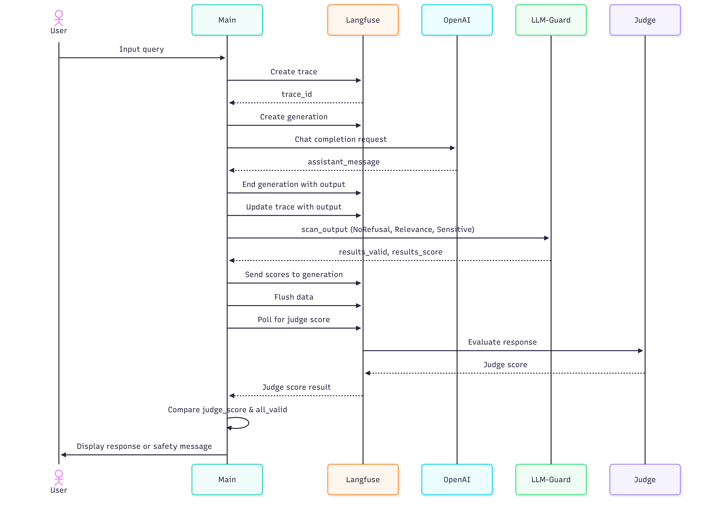

# langfuse_llm_as_a_judge_demo

## Architecture Flow



**Flow Summary:**
1. User enters a query
2. Langfuse trace is created to track the interaction
3. Query is sent to OpenAI for response generation
4. Response is logged to Langfuse
5. llm-guard scans the output for safety issues
6. Scores are sent back to Langfuse
7. System polls Langfuse for the LLM judge's evaluation score
8. Final response is displayed based on judge score and safety validation

## Getting Started

Start LangFuse services:
   ```
   docker compose up -d 
   ```
Run the application:
   ```
   docker compose run app python main.py
   ```
Or if the container is already running:
  ```   
   docker compose exec app python main.py
  ```

Option 2: Running locally (without Docker)
    
    Create and activate a virtual environment:
    python -m venv venv   
    
    # On Windows:   
    venv\Scripts\activate   
    
    # On Mac/Linux:   
    source venv/bin/activate
    
    Install dependencies:
    pip install -r requirements.txt
    
    Start LangFuse with Docker (still needed for the LangFuse server):
    docker compose up -d
    
    Run the application:
    python main.py
